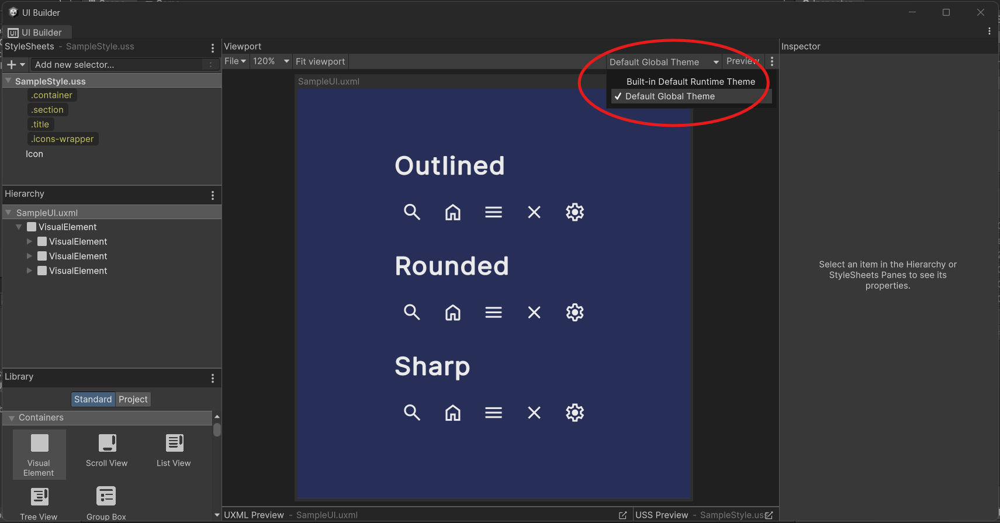
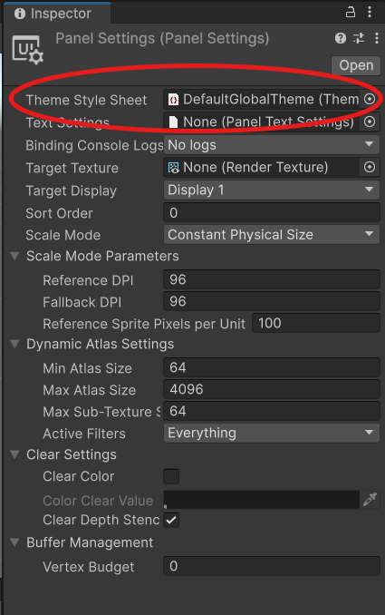
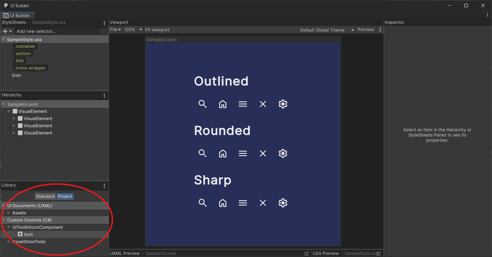
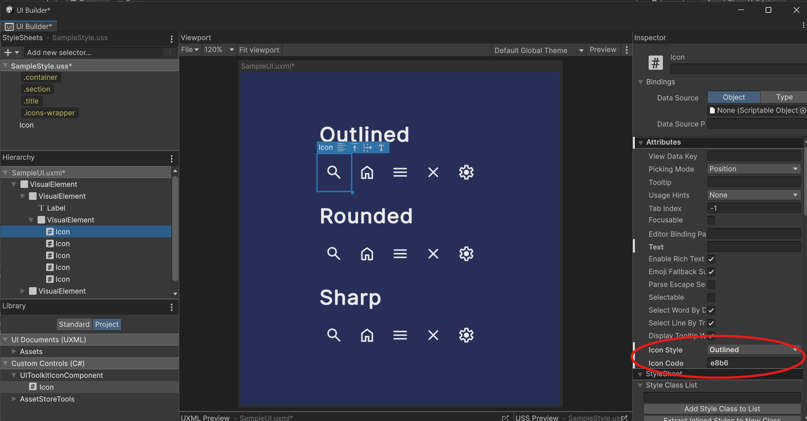
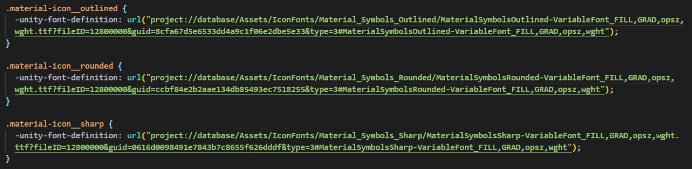

# UI Toolkit Icon Component

This is an UI Toolkit component for simple usage of icon fonts at the UI.

I built it using Google's Material Design Icons with local font files (True Type Font - ttf), but theoretically it should work with other icon packages and font files hosted anywhere accessible with small and easy modifications.

## How To Set Up

To make this component work it is necessary to either copy the content of the `DefaultGlobalTheme.tss` to your own theme file or assign it as the current theme:

UI Builder |   | Panel Settings
:----------:|:-:|:-------------:
 || 

## Usage

After doing the previous steps everything will be working and the component will be available at the UI Builder:

To display the icon you just need to type it's code at the `"Icon Code"` field:

## Using other icon packages or files

To use the component with other icon packages or files you just need to change the path to the files at `DefaultGlobalTheme.tss`:

