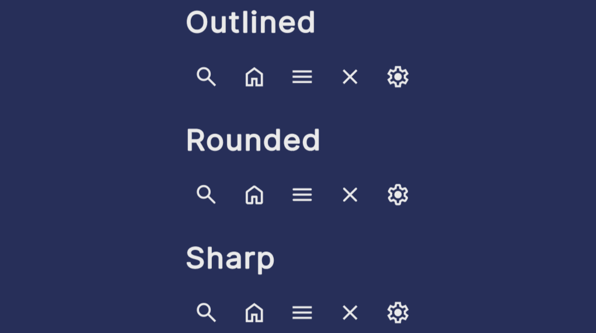

# unity-ui-toolkit-icon-component

An UI Toolkit component for simple usage of icon fonts at the UI.

> For more information about the package and it's usage check the [Package README](Assets/UI%20Toolkit%20Icon%20Component/README.md)

